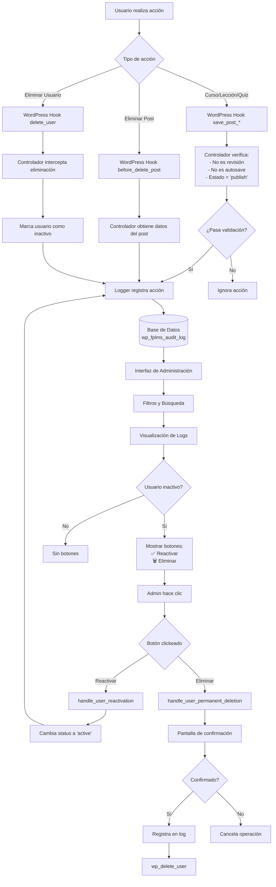

# 🔐 Sistema de Auditoría Completo - FairPlay LMS

## 📋 Tabla de Contenidos
1. [Descripción General](#descripción-general)
2. [Funcionalidades Implementadas](#funcionalidades-implementadas)
3. [Arquitectura del Sistema](#arquitectura-del-sistema)
4. [Configuración de la Base de Datos](#configuración-de-la-base-de-datos)
5. [Registro de Cursos, Lecciones y Quizzes](#registro-de-cursos-lecciones-y-quizzes)
6. [Sistema de Soft-Delete para Usuarios](#sistema-de-soft-delete-para-usuarios)
7. [Interfaz de Administración](#interfaz-de-administración)
8. [Guía de Testing](#guía-de-testing)
9. [Troubleshooting](#troubleshooting)

---

## 📖 Descripción General

El sistema de auditoría de FairPlay LMS ahora registra **TODAS** las acciones importantes que ocurren en la plataforma:

- ✅ **Creación, actualización y eliminación de cursos**
- ✅ **Adición, actualización y eliminación de lecciones**
- ✅ **Adición, actualización y eliminación de quizzes**
- ✅ **Desactivación, reactivación y eliminación permanente de usuarios**
- ✅ **Asignación y actualización de estructuras**
- ✅ **Sincronización de categorías y canales**

### Características Clave

1. **🔍 Auditoría Granular**: Cada cambio se registra con detalles completos (qué cambió, quién lo hizo, cuándo, desde qué IP)
2. **👥 Soft-Delete de Usuarios**: Los usuarios no se eliminan permanentemente, se marcan como inactivos
3. **♻️ Reactivación**: Administradores pueden reactivar usuarios desactivados con un solo clic
4. **🗑️ Eliminación Definitiva**: Proceso de dos pasos con confirmación para eliminar permanentemente
5. **📊 Filtros Avanzados**: Buscar por tipo de acción, entidad, fechas
6. **📥 Exportación**: Exportar logs a CSV para análisis externo

---

## 🚀 Funcionalidades Implementadas

### 1. Auditoría de Cursos

| Acción | Cuándo se registra | Datos capturados |
|--------|-------------------|------------------|
| `course_created` | Al publicar un nuevo curso | Título, ID, metadatos del curso |
| `course_updated` | Al actualizar un curso publicado | Título, valores anteriores y nuevos |
| `course_deleted` | Al eliminar un curso | Título, ID antes de la eliminación |

**Hook utilizado**: `save_post_stm-courses` (prioridad 30), `before_delete_post`

### 2. Auditoría de Lecciones

| Acción | Cuándo se registra | Datos capturados |
|--------|-------------------|------------------|
| `lesson_added` | Al publicar una nueva lección | Título, ID, curso asociado |
| `lesson_updated` | Al actualizar una lección publicada | Título, valores anteriores y nuevos |
| `lesson_deleted` | Al eliminar una lección | Título, ID antes de la eliminación |

**Hook utilizado**: `save_post_stm-lessons` (prioridad 10), `before_delete_post`

### 3. Auditoría de Quizzes

| Acción | Cuándo se registra | Datos capturados |
|--------|-------------------|------------------|
| `quiz_added` | Al publicar un nuevo quiz | Título, ID, curso asociado |
| `quiz_updated` | Al actualizar un quiz publicado | Título, valores anteriores y nuevos |
| `quiz_deleted` | Al eliminar un quiz | Título, ID antes de la eliminación |

**Hook utilizado**: `save_post_stm-quizzes` (prioridad 10), `before_delete_post`

### 4. Sistema de Soft-Delete para Usuarios

#### 4.1 Desactivación (Soft-Delete)

Cuando un administrador intenta eliminar un usuario, el sistema:

1. **Intercepta la acción** mediante el hook `delete_user` (prioridad 5)
2. **Marca al usuario como inactivo** usando user_meta:
   - `fplms_user_status` → `'inactive'`
   - `fplms_deactivated_date` → timestamp actual
   - `fplms_deactivated_by` → ID del admin que desactivó
3. **Registra en la auditoría**:
   - Acción: `user_deactivated`
   - Entity Type: `user`
   - Entity ID: ID del usuario
   - Entity Title: Nombre completo del usuario
   - Old Value: Email del usuario
   - New Value: `'status: inactive'`

#### 4.2 Reactivación

Los administradores pueden reactivar usuarios desde la bitácora:

1. **Botón visible** en la columna "Acciones" para usuarios desactivados
2. **Proceso seguro** con nonce verification
3. **Cambios aplicados**:
   - `fplms_user_status` → `'active'`
   - `fplms_reactivated_date` → timestamp actual
   - `fplms_reactivated_by` → ID del admin que reactivó
4. **Registro en auditoría**:
   - Acción: `user_reactivated`
   - Entity Type: `user`

#### 4.3 Eliminación Permanente

Para eliminar definitivamente un usuario:

1. **Primer clic**: Se muestra pantalla de confirmación con advertencias
2. **Advertencias mostradas**:
   - ⚠️ Esta acción NO SE PUEDE DESHACER
   - Se eliminará toda la información del usuario
   - Se eliminarán asignaciones de estructuras
   - Se eliminarán registros de progreso en cursos
   - Se eliminarán TODOS los registros relacionados
3. **Segundo clic con confirmación**: Se ejecuta eliminación
4. **Proceso**:
   - Se registra en auditoría ANTES de eliminar
   - Se ejecuta `wp_delete_user()` para eliminación real
   - Se redirige con mensaje de confirmación

---

## 🏗️ Arquitectura del Sistema

### Estructura de Clases

```
FairPlay_LMS_Audit_Logger (class-fplms-audit-logger.php)
├── create_table()                    → Crea/actualiza tabla de auditoría
├── log_course_created()              → Registra creación de curso
├── log_course_updated()              → Registra actualización de curso
├── log_course_deleted()              → Registra eliminación de curso
├── log_lesson_added()                → Registra nueva lección
├── log_lesson_updated()              → Registra actualización de lección
├── log_lesson_deleted()              → Registra eliminación de lección
├── log_quiz_added()                  → Registra nuevo quiz
├── log_quiz_updated()                → Registra actualización de quiz
├── log_quiz_deleted()                → Registra eliminación de quiz
├── log_user_deactivated()            → Registra desactivación de usuario
├── log_user_reactivated()            → Registra reactivación de usuario
├── log_user_permanently_deleted()    → Registra eliminación permanente
└── export_to_csv()                   → Exporta logs a CSV

FairPlay_LMS_Courses_Controller (class-fplms-courses.php)
├── log_course_save()                 → Handler para save_post_stm-courses
├── log_course_deletion()             → Handler para before_delete_post
├── log_lesson_save()                 → Handler para save_post_stm-lessons
├── log_lesson_deletion()             → Handler para before_delete_post (lecciones)
├── log_quiz_save()                   → Handler para save_post_stm-quizzes
└── log_quiz_deletion()               → Handler para before_delete_post (quizzes)

FairPlay_LMS_Users_Controller (class-fplms-users.php)
├── handle_user_soft_delete()         → Intercepta delete_user y marca como inactivo
├── is_user_inactive()                → Verifica si usuario está inactivo
├── reactivate_user()                 → Reactiva usuario y registra en auditoría
└── permanently_delete_user()         → Elimina permanentemente y registra

FairPlay_LMS_Audit_Admin (class-fplms-audit-admin.php)
├── render_logs_table()               → Muestra tabla de auditoría con botones
├── render_action_buttons()           → Renderiza botones de acción para usuarios
├── format_action()                   → Formatea nombres de acciones en español
├── handle_user_reactivation()        → Procesa reactivación desde admin
└── handle_user_permanent_deletion()  → Procesa eliminación permanente desde admin
```

### Flujo de Datos



---

## 🗄️ Configuración de la Base de Datos

### Tabla: `wp_fplms_audit_log`

```sql
CREATE TABLE IF NOT EXISTS wp_fplms_audit_log (
    id BIGINT(20) UNSIGNED NOT NULL AUTO_INCREMENT,
    timestamp DATETIME DEFAULT CURRENT_TIMESTAMP,
    user_id BIGINT(20) UNSIGNED NOT NULL,
    action VARCHAR(255) NOT NULL,
    entity_type VARCHAR(100) NOT NULL,
    entity_id BIGINT(20) NOT NULL,
    entity_title VARCHAR(255),
    old_value TEXT,
    new_value TEXT,
    ip_address VARCHAR(45),
    user_agent TEXT,
    status VARCHAR(20) DEFAULT 'completed',
    meta_data TEXT,
    PRIMARY KEY (id),
    KEY idx_timestamp (timestamp),
    KEY idx_user_id (user_id),
    KEY idx_action (action),
    KEY idx_entity (entity_type, entity_id),
    KEY idx_status (status)
) ENGINE=InnoDB DEFAULT CHARSET=utf8mb4 COLLATE=utf8mb4_unicode_ci;
```

### Columnas Clave

| Columna | Tipo | Descripción | Ejemplo |
|---------|------|-------------|---------|
| `id` | BIGINT | ID único del registro | 1234 |
| `timestamp` | DATETIME | Fecha/hora de la acción | 2025-01-15 14:32:45 |
| `user_id` | BIGINT | ID del usuario que realizó la acción | 5 |
| `action` | VARCHAR(255) | Tipo de acción realizada | `course_created` |
| `entity_type` | VARCHAR(100) | Tipo de entidad afectada | `course`, `lesson`, `user` |
| `entity_id` | BIGINT | ID de la entidad | 456 |
| `entity_title` | VARCHAR(255) | Título/nombre de la entidad | "Introducción a PHP" |
| `old_value` | TEXT | Valor antes del cambio (JSON) | `{"status": "active"}` |
| `new_value` | TEXT | Valor después del cambio (JSON) | `{"status": "inactive"}` |
| `status` | VARCHAR(20) | Estado del registro | `completed` |
| `meta_data` | TEXT | Metadatos adicionales (JSON) | `{"course_id": 123}` |

### User Meta Fields (para Soft-Delete)

| Meta Key | Descripción | Valores posibles |
|----------|-------------|------------------|
| `fplms_user_status` | Estado del usuario | `'active'`, `'inactive'` |
| `fplms_deactivated_date` | Fecha de desactivación | Timestamp |
| `fplms_deactivated_by` | ID del admin que desactivó | User ID |
| `fplms_reactivated_date` | Fecha de reactivación | Timestamp |
| `fplms_reactivated_by` | ID del admin que reactivó | User ID |

---

## 📚 Registro de Cursos, Lecciones y Quizzes

### Implementación en `class-fplms-courses.php`

#### Validaciones Aplicadas

Todos los métodos de logging verifican:

```php
// 1. No registrar revisiones automáticas
if ( wp_is_post_revision( $post_id ) ) {
    return;
}

// 2. No registrar autoguardados
if ( wp_is_post_autosave( $post_id ) ) {
    return;
}

// 3. Solo registrar posts publicados
$post = get_post( $post_id );
if ( ! $post || $post->post_status !== 'publish' ) {
    return;
}
```

#### Ejemplo: log_course_save()

```php
public function log_course_save( int $post_id, WP_Post $post, bool $update ): void {
    // Validaciones...
    
    if ( $update ) {
        // Es actualización - obtener valores anteriores
        $old_data = [
            'title'   => $post->post_title,
            'content' => $post->post_content,
            'status'  => $post->post_status,
        ];
        
        $new_data = [
            'title'   => $post->post_title,
            'content' => $post->post_content,
            'status'  => $post->post_status,
        ];
        
        $this->logger->log_course_updated(
            $post_id,
            $post->post_title,
            $old_data,
            $new_data
        );
    } else {
        // Es creación
        $meta_data = [
            'post_type'   => $post->post_type,
            'post_author' => $post->post_author,
            'timestamp'   => current_time( 'mysql' ),
        ];
        
        $this->logger->log_course_created(
            $post_id,
            $post->post_title,
            $meta_data
        );
    }
}
```

### Hooks Registrados en `class-fplms-plugin.php`

```php
// CURSOS
add_action( 'save_post_stm-courses', [ $this->courses, 'log_course_save' ], 30, 3 );
add_action( 'before_delete_post', [ $this->courses, 'log_course_deletion' ], 10, 1 );

// LECCIONES
add_action( 'save_post_stm-lessons', [ $this->courses, 'log_lesson_save' ], 10, 3 );
add_action( 'before_delete_post', [ $this->courses, 'log_lesson_deletion' ], 10, 1 );

// QUIZZES
add_action( 'save_post_stm-quizzes', [ $this->courses, 'log_quiz_save' ], 10, 3 );
add_action( 'before_delete_post', [ $this->courses, 'log_quiz_deletion' ], 10, 1 );
```

**Nota sobre prioridades**:
- Cursos: prioridad **30** (después de sync de estructuras que tiene prioridad 20)
- Lecciones/Quizzes: prioridad **10** (estándar)

---

## 👥 Sistema de Soft-Delete para Usuarios

### Implementación en `class-fplms-users.php`

#### 1. handle_user_soft_delete()

Intercepta intentos de eliminación:

```php
public function handle_user_soft_delete( int $user_id, ?int $reassign = null, WP_User $user = null ): void {
    // No interceptar si el usuario ya no existe
    if ( ! $user && ! ( $user = get_userdata( $user_id ) ) ) {
        return;
    }
    
    // Marcar como inactivo
    update_user_meta( $user_id, 'fplms_user_status', 'inactive' );
    update_user_meta( $user_id, 'fplms_deactivated_date', current_time( 'mysql' ) );
    update_user_meta( $user_id, 'fplms_deactivated_by', get_current_user_id() );
    
    // Registrar en auditoría
    $this->logger->log_user_deactivated(
        $user_id,
        $user->display_name,
        $user->user_email
    );
}
```

**Hook**: `delete_user` con prioridad **5** (ejecuta ANTES de la eliminación real)

#### 2. reactivate_user()

Reactiva un usuario desactivado:

```php
public function reactivate_user( int $user_id ): bool {
    $user = get_userdata( $user_id );
    if ( ! $user ) {
        return false;
    }
    
    // Cambiar status a activo
    update_user_meta( $user_id, 'fplms_user_status', 'active' );
    update_user_meta( $user_id, 'fplms_reactivated_date', current_time( 'mysql' ) );
    update_user_meta( $user_id, 'fplms_reactivated_by', get_current_user_id() );
    
    // Registrar reactivación
    $this->logger->log_user_reactivated(
        $user_id,
        $user->display_name,
        $user->user_email
    );
    
    return true;
}
```

#### 3. permanently_delete_user()

Elimina permanentemente (con registro previo):

```php
public function permanently_delete_user( int $user_id, ?int $reassign = null ): bool {
    $user = get_userdata( $user_id );
    if ( ! $user ) {
        return false;
    }
    
    // IMPORTANTE: Registrar ANTES de eliminar
    $this->logger->log_user_permanently_deleted(
        $user_id,
        $user->display_name,
        $user->user_email
    );
    
    // Eliminar usando función nativa de WordPress
    require_once ABSPATH . 'wp-admin/includes/user.php';
    return wp_delete_user( $user_id, $reassign );
}
```

### Handlers de Admin en `class-fplms-audit-admin.php`

#### handle_user_reactivation()

Procesa solicitudes de reactivación:

```php
public function handle_user_reactivation(): void {
    // Verificar permisos
    if ( ! current_user_can( 'manage_options' ) ) {
        wp_die( '❌ No tienes permisos para realizar esta acción.' );
    }
    
    // Verificar nonce
    if ( ! isset( $_GET['_wpnonce'] ) || ! wp_verify_nonce( $_GET['_wpnonce'], 'fplms_reactivate_user' ) ) {
        wp_die( '❌ Nonce de seguridad inválido.' );
    }
    
    // Obtener user_id
    $user_id = isset( $_GET['user_id'] ) ? absint( $_GET['user_id'] ) : 0;
    if ( ! $user_id ) {
        wp_die( '❌ ID de usuario inválido.' );
    }
    
    // Reactivar usuario
    $users_controller = new FairPlay_LMS_Users_Controller();
    $success = $users_controller->reactivate_user( $user_id );
    
    // Redirigir con mensaje
    wp_safe_redirect( add_query_arg(
        'reactivation_status',
        $success ? 'success' : 'error',
        admin_url( 'admin.php?page=fairplay-lms-audit' )
    ) );
    exit;
}
```

#### handle_user_permanent_deletion()

Proceso de dos pasos con confirmación:

```php
public function handle_user_permanent_deletion(): void {
    // Verificaciones de seguridad...
    
    $user_id = absint( $_GET['user_id'] );
    $confirm = isset( $_GET['confirm'] ) && $_GET['confirm'] === 'yes';
    
    if ( ! $confirm ) {
        // PASO 1: Mostrar pantalla de confirmación
        ?>
        <div class="wrap">
            <h1>⚠️ Confirmar Eliminación Permanente</h1>
            <div style="background: #fff3cd; border-left: 4px solid #ff9800; padding: 20px; margin: 20px 0;">
                <h2 style="color: #ff5722; margin-top: 0;">ADVERTENCIA: Esta acción NO SE PUEDE DESHACER</h2>
                <p><strong>Estás a punto de eliminar PERMANENTEMENTE al usuario:</strong></p>
                <ul style="font-size: 16px; line-height: 2; list-style: disc inside;">
                    <li>Se eliminará toda la información del usuario</li>
                    <li>Se eliminarán sus asignaciones de estructuras</li>
                    <li>Se eliminarán sus registros de progreso en cursos</li>
                    <li>Se eliminarán TODOS los registros relacionados</li>
                </ul>
                <p style="font-size: 18px; font-weight: bold; color: #d32f2f;">¿Estás COMPLETAMENTE SEGURO?</p>
            </div>
            <p>
                <a href="<?php echo esc_url( wp_nonce_url( add_query_arg( 'confirm', 'yes' ), 'fplms_delete_user_permanently' ) ); ?>" 
                   class="button button-large button-delete" 
                   style="background: #d32f2f; color: white; border-color: #d32f2f;">
                    🗑️ SÍ, ELIMINAR PERMANENTEMENTE
                </a>
                <a href="<?php echo esc_url( admin_url( 'admin.php?page=fairplay-lms-audit' ) ); ?>" 
                   class="button button-large button-primary">
                    ↩️ NO, VOLVER A LA BITÁCORA
                </a>
            </p>
        </div>
        <?php
        exit;
    }
    
    // PASO 2: Ejecutar eliminación
    $users_controller = new FairPlay_LMS_Users_Controller();
    $success = $users_controller->permanently_delete_user( $user_id );
    
    wp_safe_redirect( add_query_arg(
        'deletion_status',
        $success ? 'success' : 'error',
        admin_url( 'admin.php?page=fairplay-lms-audit' )
    ) );
    exit;
}
```

---

## 🎨 Interfaz de Administración

### Tabla de Auditoría

La tabla ahora incluye **9 columnas**:

| # | Columna | Descripción | Ancho |
|---|---------|-------------|-------|
| 1 | **ID** | ID del registro | 60px |
| 2 | **Fecha/Hora** | Timestamp formateado (dd/mm/YYYY HH:MM) | 150px |
| 3 | **Usuario** | Nombre del usuario que realizó la acción | 120px |
| 4 | **Acción** | Tipo de acción (con emoji) | 180px |
| 5 | **Tipo** | Tipo de entidad (badge) | 100px |
| 6 | **Entidad** | Título + ID de la entidad | flexible |
| 7 | **IP** | Dirección IP del usuario | 100px |
| 8 | **Detalles** | Botón para expandir detalles | 80px |
| 9 | **Acciones** | ✅ Reactivar / 🗑️ Eliminar (solo usuarios) | 150px |

### Columna de Acciones (Nueva)

#### render_action_buttons()

```php
private function render_action_buttons( array $log ): void {
    // Solo mostrar para usuarios desactivados
    if ( $log['entity_type'] !== 'user' || $log['action'] !== 'user_deactivated' ) {
        echo '<span style="color: #999;">—</span>';
        return;
    }
    
    $user_id = $log['entity_id'];
    $user = get_userdata( $user_id );
    
    // Verificar si existe y está inactivo
    if ( ! $user ) {
        echo '<span style="color: #999; font-size: 11px;">Usuario ya eliminado</span>';
        return;
    }
    
    $user_status = get_user_meta( $user_id, 'fplms_user_status', true );
    if ( $user_status !== 'inactive' ) {
        echo '<span style="color: #00a32a; font-size: 11px;">✅ Ya reactivado</span>';
        return;
    }
    
    // Generar URLs con nonce
    $reactivate_url = wp_nonce_url(
        admin_url( 'admin-post.php?action=fplms_reactivate_user&user_id=' . $user_id ),
        'fplms_reactivate_user'
    );
    
    $delete_url = wp_nonce_url(
        admin_url( 'admin-post.php?action=fplms_permanently_delete_user&user_id=' . $user_id ),
        'fplms_delete_user_permanently'
    );
    
    ?>
    <div style="display: flex; gap: 5px; flex-direction: column;">
        <a href="<?php echo esc_url( $reactivate_url ); ?>" 
           class="button button-small button-primary" 
           style="text-align: center;">
            ✅ Reactivar
        </a>
        <a href="<?php echo esc_url( $delete_url ); ?>" 
           class="button button-small button-link-delete fplms-delete-permanently" 
           style="color: #d63638; text-align: center;">
            🗑️ Eliminar Definitivo
        </a>
    </div>
    <?php
}
```

### Filtros Actualizados

Los filtros ahora incluyen **TODAS** las acciones agrupadas por categoría:

```html
<select name="filter_action">
    <option value="">Todas las acciones</option>
    
    <optgroup label="📘 Cursos">
        <option value="course_created">Curso Creado</option>
        <option value="course_updated">Curso Actualizado</option>
        <option value="course_deleted">Curso Eliminado</option>
    </optgroup>
    
    <optgroup label="📝 Lecciones">
        <option value="lesson_added">Lección Agregada</option>
        <option value="lesson_updated">Lección Actualizada</option>
        <option value="lesson_deleted">Lección Eliminada</option>
    </optgroup>
    
    <optgroup label="❓ Quizzes">
        <option value="quiz_added">Quiz Agregado</option>
        <option value="quiz_updated">Quiz Actualizado</option>
        <option value="quiz_deleted">Quiz Eliminado</option>
    </optgroup>
    
    <optgroup label="👥 Usuarios">
        <option value="user_deactivated">Usuario Desactivado</option>
        <option value="user_reactivated">Usuario Reactivado</option>
        <option value="user_permanently_deleted">Usuario Eliminado</option>
    </optgroup>
    
    <optgroup label="🏢 Estructuras">
        <option value="structures_assigned">Estructuras Asignadas</option>
        <option value="structures_updated">Estructuras Actualizadas</option>
        <option value="course_structures_synced_from_categories">Sincronización desde Categorías</option>
        <option value="channel_category_sync">Canal→Categoría Sync</option>
    </optgroup>
</select>
```

### Formato de Acciones

Todas las acciones tienen etiquetas en español con emojis:

```php
private function format_action( string $action ): string {
    $actions = [
        // Cursos
        'course_created'  => '📘 Curso Creado',
        'course_updated'  => '✏️ Curso Actualizado',
        'course_deleted'  => '🗑️ Curso Eliminado',
        
        // Lecciones
        'lesson_added'    => '📝 Lección Agregada',
        'lesson_updated'  => '✏️ Lección Actualizada',
        'lesson_deleted'  => '🗑️ Lección Eliminada',
        
        // Quizzes
        'quiz_added'      => '❓ Quiz Agregado',
        'quiz_updated'    => '✏️ Quiz Actualizado',
        'quiz_deleted'    => '🗑️ Quiz Eliminado',
        
        // Usuarios
        'user_deactivated' => '❌ Usuario Desactivado',
        'user_reactivated' => '✅ Usuario Reactivado',
        'user_permanently_deleted' => '🔥 Usuario Eliminado Permanentemente',
        
        // ... más acciones
    ];
    
    return $actions[ $action ] ?? ucwords( str_replace( '_', ' ', $action ) );
}
```

---

## 🧪 Guía de Testing

### Test 1: Auditoría de Curso

#### Objetivo
Verificar que se registren creación, actualización y eliminación de cursos.

#### Pasos

1. **Crear un nuevo curso**:
   ```
   - Ir a: Cursos → Añadir Nuevo
   - Título: "Curso de Testing - Auditoría"
   - Contenido: "Este es un curso de prueba"
   - Publicar
   ```

2. **Verificar registro en auditoría**:
   ```
   - Ir a: FairPlay LMS → Bitácora de Auditoría
   - Filtrar por: Acción = "Curso Creado"
   - Debe aparecer: "📘 Curso Creado" | entity_id = [ID del curso] | entity_title = "Curso de Testing - Auditoría"
   - Clic en "👁️ Ver" para ver detalles
   - Debe mostrar metadatos del curso en "Valor Nuevo"
   ```

3. **Actualizar el curso**:
   ```
   - Editar el curso creado
   - Cambiar título a: "Curso de Testing - Actualizado"
   - Actualizar
   ```

4. **Verificar actualización**:
   ```
   - Recargar bitácora
   - Filtrar por: Acción = "Curso Actualizado"
   - Debe mostrar: old_value con título anterior, new_value con título nuevo
   ```

5. **Eliminar el curso**:
   ```
   - Mover a papelera o eliminar permanentemente
   ```

6. **Verificar eliminación**:
   ```
   - Filtrar por: Acción = "Curso Eliminado"
   - Debe registrar la eliminación con título y ID
   ```

#### Resultado Esperado
✅ 3 registros en auditoría: creación, actualización, eliminación

---

### Test 2: Auditoría de Lecciones

#### Objetivo
Verificar registro completo de lecciones.

#### Pasos

1. **Crear curso padre**:
   ```
   - Título: "Curso para Lecciones"
   - Publicar
   ```

2. **Agregar lección**:
   ```
   - Ir a: Lecciones → Añadir Nueva
   - Título: "Lección 1: Introducción"
   - Asignar al curso creado
   - Publicar
   ```

3. **Verificar en auditoría**:
   ```
   - Filtrar por: Tipo de Entidad = "Lección"
   - Acción: "Lección Agregada"
   - Debe mostrar título y curso asociado en meta_data
   ```

4. **Actualizar lección**:
   ```
   - Cambiar título a "Lección 1: Introducción Mejorada"
   - Actualizar
   ```

5. **Verificar actualización**:
   ```
   - Debe registrar "Lección Actualizada" con old_value y new_value
   ```

6. **Eliminar lección**:
   ```
   - Eliminar la lección
   ```

7. **Verificar eliminación**:
   ```
   - Debe registrar "Lección Eliminada"
   ```

#### Resultado Esperado
✅ 3 registros: agregada, actualizada, eliminada

---

### Test 3: Auditoría de Quizzes

#### Objetivo
Verificar registro de quizzes.

#### Pasos

Similares al Test 2, pero con quizzes:

1. Crear quiz con título "Quiz 1: Evaluación Inicial"
2. Verificar registro "Quiz Agregado"
3. Actualizar quiz
4. Verificar registro "Quiz Actualizado"
5. Eliminar quiz
6. Verificar registro "Quiz Eliminado"

#### Resultado Esperado
✅ 3 registros: agregado, actualizado, eliminado

---

### Test 4: Soft-Delete de Usuario

#### Objetivo
Verificar que usuarios se marquen como inactivos en lugar de eliminarse.

#### Pasos

1. **Crear usuario de prueba**:
   ```
   - Ir a: Usuarios → Añadir Nuevo
   - Nombre de usuario: "usuario_prueba_audit"
   - Email: test_audit@fairplaylms.com
   - Rol: Suscriptor
   - Guardar
   ```

2. **Intentar eliminar usuario**:
   ```
   - Ir a: Usuarios → Todos los Usuarios
   - Buscar "usuario_prueba_audit"
   - Clic en "Eliminar"
   - Confirmar eliminación
   ```

3. **Verificar desactivación**:
   ```
   - Ir a: FairPlay LMS → Bitácora de Auditoría
   - Filtrar por: Acción = "Usuario Desactivado"
   - Debe aparecer registro con:
     * entity_type = 'user'
     * entity_id = [ID del usuario]
     * entity_title = "usuario_prueba_audit"
     * old_value = email del usuario
     * new_value = "status: inactive"
   ```

4. **Verificar user_meta**:
   ```sql
   SELECT * FROM wp_usermeta 
   WHERE user_id = [ID] AND meta_key LIKE 'fplms_%';
   ```
   
   Debe mostrar:
   ```
   fplms_user_status = 'inactive'
   fplms_deactivated_date = [timestamp]
   fplms_deactivated_by = [ID del admin]
   ```

5. **Verificar que usuario aún existe**:
   ```sql
   SELECT ID, user_login, user_email FROM wp_users WHERE ID = [ID];
   ```
   
   Debe devolver el usuario (no fue eliminado realmente)

#### Resultado Esperado
✅ Usuario marcado como inactivo, NO eliminado de la base de datos
✅ Registro en auditoría con action = 'user_deactivated'
✅ User meta actualizado correctamente

---

### Test 5: Reactivación de Usuario

#### Objetivo
Verificar que administradores puedan reactivar usuarios desde la bitácora.

#### Prerrequisitos
- Tener un usuario desactivado (del Test 4)

#### Pasos

1. **Acceder a bitácora**:
   ```
   - Ir a: FairPlay LMS → Bitácora de Auditoría
   - Filtrar por: Acción = "Usuario Desactivado"
   ```

2. **Verificar botones de acción**:
   ```
   - En la columna "Acciones" debe aparecer:
     * ✅ Reactivar (botón azul)
     * 🗑️ Eliminar Definitivo (botón rojo)
   ```

3. **Clic en "✅ Reactivar"**:
   ```
   - Confirmar la acción
   - Debe redirigir a bitácora con mensaje de éxito
   ```

4. **Verificar reactivación**:
   ```
   - Filtrar por: Acción = "Usuario Reactivado"
   - Debe aparecer nuevo registro con:
     * action = 'user_reactivated'
     * entity_id = [ID del usuario]
     * timestamp actual
   ```

5. **Verificar user_meta actualizado**:
   ```sql
   SELECT meta_key, meta_value FROM wp_usermeta 
   WHERE user_id = [ID] AND meta_key LIKE 'fplms_%';
   ```
   
   Debe mostrar:
   ```
   fplms_user_status = 'active'
   fplms_reactivated_date = [nuevo timestamp]
   fplms_reactivated_by = [ID del admin actual]
   ```

6. **Verificar que botones desaparecen**:
   ```
   - Recargar bitácora
   - Buscar el registro de "Usuario Reactivado"
   - En columna "Acciones" debe mostrar:
     "✅ Ya reactivado" (sin botones)
   ```

7. **Verificar acceso del usuario**:
   ```
   - Intentar iniciar sesión con el usuario reactivado
   - Debe poder acceder normalmente
   ```

#### Resultado Esperado
✅ Usuario reactivado correctamente
✅ Registro de reactivación en auditoría
✅ User meta actualizado con status 'active'
✅ Usuario puede iniciar sesión

---

### Test 6: Eliminación Permanente de Usuario

#### Objetivo
Verificar proceso de dos pasos para eliminación definitiva.

#### ⚠️ ADVERTENCIA
Este test elimina datos reales. Usar solo con usuarios de prueba.

#### Pasos

1. **Crear usuario de prueba para eliminar**:
   ```
   - Nombre: usuario_delete_test
   - Email: delete_test@fairplaylms.com
   - Guardar y anotar ID
   ```

2. **Marcar como inactivo** (primero desactivar):
   ```
   - Ir a lista de usuarios
   - Eliminar usuario (quedará inactivo)
   ```

3. **Ir a bitácora**:
   ```
   - Filtrar por: Acción = "Usuario Desactivado"
   - Localizar registro del usuario de prueba
   ```

4. **Clic en "🗑️ Eliminar Definitivo"**:
   ```
   - Debe mostrar pantalla de confirmación con:
     * Título: "⚠️ Confirmar Eliminación Permanente"
     * Fondo amarillo con advertencias
     * Lista de bullet points con consecuencias
     * 2 botones: "SÍ, ELIMINAR PERMANENTEMENTE" (rojo) y "NO, VOLVER" (azul)
   ```

5. **Leer advertencias**:
   ```
   Debe mostrar:
   - "Esta acción NO SE PUEDE DESHACER"
   - "Se eliminará toda la información del usuario"
   - "Se eliminarán sus asignaciones de estructuras"
   - "Se eliminarán sus registros de progreso en cursos"
   - "Se eliminarán TODOS los registros relacionados"
   ```

6. **Primera opción: Cancelar**:
   ```
   - Clic en "NO, VOLVER A LA BITÁCORA"
   - Debe volver a bitácora sin cambios
   - Usuario debe seguir existiendo
   ```

7. **Segunda opción: Confirmar eliminación**:
   ```
   - Volver a hacer clic en "🗑️ Eliminar Definitivo"
   - Esta vez clic en "SÍ, ELIMINAR PERMANENTEMENTE"
   - Debe redirigir con mensaje de confirmación
   ```

8. **Verificar registro en auditoría**:
   ```
   - Filtrar por: Acción = "Usuario Eliminado Permanentemente"
   - Debe aparecer registro con:
     * action = 'user_permanently_deleted'
     * entity_id = [ID del usuario]
     * entity_title = nombre del usuario
     * old_value = email del usuario
     * timestamp JUSTO ANTES de la eliminación
   ```

9. **Verificar eliminación real**:
   ```sql
   SELECT * FROM wp_users WHERE ID = [ID del usuario];
   ```
   
   Resultado esperado: **0 rows** (usuario eliminado de verdad)

10. **Verificar que no se puede reactivar**:
    ```
    - Buscar registro de eliminación en bitácora
    - Columna "Acciones" debe mostrar:
      "Usuario ya eliminado" (sin botones)
    ```

#### Resultado Esperado
✅ Proceso de dos pasos funciona correctamente
✅ Primera confirmación muestra advertencias claras
✅ Cancelación funciona
✅ Eliminación definitiva registra en auditoría
✅ Usuario eliminado permanentemente de la base de datos
✅ Botones de acción desaparecen para usuarios eliminados

---

### Test 7: Filtros de Auditoría

#### Objetivo
Verificar que todos los filtros funcionen correctamente.

#### Pasos

1. **Filtro por Acción**:
   ```
   - Filtrar por: "Curso Creado"
   - Solo deben aparecer registros de cursos creados
   - Cambiar a "Usuario Desactivado"
   - Solo deben aparecer usuarios desactivados
   ```

2. **Filtro por Tipo de Entidad**:
   ```
   - Filtrar por: "📘 Curso"
   - Solo registros de cursos
   - Cambiar a "📝 Lección"
   - Solo registros de lecciones
   - Cambiar a "👤 Usuario"
   - Solo registros de usuarios
   ```

3. **Filtro por Fechas**:
   ```
   - Desde: Hoy (fecha actual)
   - Hasta: Hoy
   - Solo deben aparecer registros de hoy
   ```

4. **Combinación de Filtros**:
   ```
   - Acción: "Curso Creado"
   - Tipo: "course"
   - Desde: [hace 1 semana]
   - Hasta: [hoy]
   - Clic en "🔍 Filtrar"
   - Solo cursos creados en la última semana
   ```

5. **Limpiar Filtros**:
   ```
   - Clic en "🔄 Limpiar Filtros"
   - Todos los filtros deben resetearse
   - Debe mostrar todos los registros
   ```

#### Resultado Esperado
✅ Todos los filtros funcionan individualmente
✅ Combinación de filtros funciona correctamente
✅ Limpiar filtros resetea todo

---

### Test 8: Exportación a CSV

#### Objetivo
Verificar exportación de logs con filtros aplicados.

#### Pasos

1. **Exportar todos los registros**:
   ```
   - Sin aplicar filtros
   - Clic en "📥 Exportar CSV"
   - Debe descargar archivo: fplms-audit-log-[fecha]-[hora].csv
   ```

2. **Abrir CSV**:
   ```
   - Abrir con Excel/LibreOffice
   - Verificar columnas:
     * ID, Fecha/Hora, Usuario, Acción, Tipo, Entidad, IP, User Agent
   - Verificar que tenga todos los registros
   ```

3. **Exportar con filtros**:
   ```
   - Filtrar por: Acción = "Usuario Desactivado"
   - Clic en "📥 Exportar CSV"
   - Debe descargar CSV con SOLO usuarios desactivados
   ```

4. **Verificar encoding UTF-8**:
   ```
   - Verificar que acentos y emojis se muestren correctamente
   - El archivo debe tener BOM UTF-8 para Excel
   ```

#### Resultado Esperado
✅ CSV se descarga correctamente
✅ Contiene todas las columnas necesarias
✅ Respeta filtros aplicados
✅ Encoding UTF-8 funciona (acentos correctos)

---

### Test 9: Validación de Revisiones y Autosaves

#### Objetivo
Verificar que NO se registren revisiones automáticas ni autosaves.

#### Pasos

1. **Crear curso**:
   ```
   - Título: "Curso Test Revisiones"
   - NO publicar, guardar como borrador
   ```

2. **Verificar que NO se registró**:
   ```
   - Ir a bitácora
   - Filtrar por: Acción = "Curso Creado"
   - NO debe aparecer el curso (porque está en borrador)
   ```

3. **Publicar curso**:
   ```
   - Cambiar estado a "Publicado"
   - Actualizar
   ```

4. **Verificar que AHORA SÍ se registró**:
   ```
   - Debe aparecer "Curso Creado"
   ```

5. **Editar y hacer autosave**:
   ```
   - Abrir curso en editor
   - Hacer cambios en el título
   - Esperar a que WordPress haga autosave automático (ícono girando)
   ```

6. **Verificar que autosave NO se registró**:
   ```
   - Recargar bitácora
   - NO debe aparecer registro de actualización por el autosave
   ```

7. **Publicar cambios manualmente**:
   ```
   - Clic en "Actualizar" manualmente
   ```

8. **Verificar que AHORA SÍ se registró la actualización**:
   ```
   - Debe aparecer "Curso Actualizado" con el cambio manual
   ```

#### Resultado Esperado
✅ Borradores NO se registran
✅ Autosaves NO se registran
✅ Solo se registran publicaciones y actualizaciones manuales

---

### Test 10: Permisos de Administrador

#### Objetivo
Verificar que solo administradores puedan reactivar/eliminar usuarios.

#### Pasos

1. **Crear usuario sin permisos de admin**:
   ```
   - Rol: Editor o Autor
   - Guardar
   ```

2. **Iniciar sesión como usuario no-admin**:
   ```
   - Cerrar sesión de admin
   - Iniciar con usuario de prueba
   ```

3. **Acceder a bitácora**:
   ```
   - Intentar ir a: /wp-admin/admin.php?page=fairplay-lms-audit
   ```

4. **Verificar restricción**:
   ```
   - Debe mostrar mensaje: "No tienes permisos para acceder a esta página"
   - O redirigir al dashboard
   ```

5. **Intentar acceso directo a reactivación**:
   ```
   - Copiar URL de reactivación de un usuario inactivo
   - Pegar en navegador (como usuario no-admin)
   - Intentar acceder
   ```

6. **Verificar error de permisos**:
   ```
   - Debe mostrar: "❌ No tienes permisos para realizar esta acción."
   - Usuario NO debe reactivarse
   ```

7. **Cerrar sesión y volver como admin**:
   ```
   - Iniciar sesión como administrador
   - Repetir acceso a reactivación
   - Debe funcionar correctamente
   ```

#### Resultado Esperado
✅ Solo administradores pueden ver la bitácora
✅ Solo administradores pueden reactivar usuarios
✅ Solo administradores pueden eliminar permanentemente
✅ Usuarios sin permisos reciben mensaje de error

---

## 🔧 Troubleshooting

### Problema 1: No se registran acciones de cursos

**Síntomas**:
- Se crea/edita un curso pero no aparece en la bitácora

**Diagnóstico**:

1. Verificar que el hook esté registrado:
   ```php
   // En class-fplms-plugin.php
   add_action( 'save_post_stm-courses', [ $this->courses, 'log_course_save' ], 30, 3 );
   ```

2. Verificar prioridad (debe ser 30, después de sync de estructuras)

3. Revisar estado del post:
   ```php
   // Solo se registran posts con status 'publish'
   if ( $post->post_status !== 'publish' ) {
       return;
   }
   ```

**Solución**:
- Asegurarse de que el curso esté PUBLICADO (no borrador)
- Verificar que no sea una revisión o autosave
- Revisar logs de PHP por errores

---

### Problema 2: Usuarios se eliminan en lugar de desactivarse

**Síntomas**:
- Al eliminar usuario, desaparece completamente de la base de datos

**Diagnóstico**:

1. Verificar que el hook esté registrado con prioridad correcta:
   ```php
   add_action( 'delete_user', [ $this->users, 'handle_user_soft_delete' ], 5, 3 );
   ```

2. Prioridad debe ser **5** (baja) para ejecutar ANTES de la eliminación real

**Solución**:
```php
// Verificar que el hook NO está siendo removido por otro plugin
// En class-fplms-plugin.php línea 183:
add_action( 'delete_user', [ $this->users, 'handle_user_soft_delete' ], 5, 3 );
```

Si el problema persiste:
```php
// Agregar log de debug en handle_user_soft_delete()
error_log( "FairPlay LMS: Interceptando eliminación de usuario ID: {$user_id}" );
```

---

### Problema 3: Botones de reactivación no aparecen

**Síntomas**:
- Columna "Acciones" muestra "—" para usuarios desactivados

**Diagnóstico**:

1. Verificar status del usuario en la base de datos:
   ```sql
   SELECT user_id, meta_key, meta_value 
   FROM wp_usermeta 
   WHERE meta_key = 'fplms_user_status' 
   AND user_id = [ID];
   ```

2. Verificar que la acción sea exactamente `user_deactivated`:
   ```sql
   SELECT id, action, entity_type, entity_id 
   FROM wp_fplms_audit_log 
   WHERE entity_type = 'user' 
   AND action LIKE '%deactiv%'
   ORDER BY id DESC LIMIT 10;
   ```

**Solución**:

Si el user_meta no existe:
```php
// Ejecutar manualmente para corregir
update_user_meta( [USER_ID], 'fplms_user_status', 'inactive' );
```

Si la acción en auditoría es diferente:
```php
// Verificar en class-fplms-audit-logger.php método log_user_deactivated()
// Debe registrar action = 'user_deactivated' (sin typo)
```

---

### Problema 4: Error "Call to undefined method" al guardar curso

**Síntomas**:
```
Fatal error: Call to undefined method FairPlay_LMS_Audit_Logger::log_course_created()
```

**Diagnóstico**:
- El logger no está inicializado o el método no existe

**Solución**:

1. Verificar que el logger esté inicializado en constructor:
   ```php
   // En class-fplms-courses.php
   public function __construct() {
       parent::__construct();
       $this->logger = new FairPlay_LMS_Audit_Logger();
   }
   ```

2. Verificar que el método exista en class-fplms-audit-logger.php:
   ```php
   public function log_course_created( int $course_id, string $title, array $meta_data = [] ): void {
       // ...
   }
   ```

3. Verificar includes en el plugin principal:
   ```php
   // En fairplay-lms-masterstudy-extensions.php
   require_once plugin_dir_path( __FILE__ ) . 'includes/class-fplms-audit-logger.php';
   ```

---

### Problema 5: Tabla de auditoría desalineada

**Síntomas**:
- Columnas no se ven correctamente
- Botones se salen del contenedor

**Diagnóstico**:
- El colspan de la fila de detalles no coincide

**Solución**:

Verificar que el colspan sea **9** (número de columnas):

```php
// En class-fplms-audit-admin.php método render_logs_table()
<tr id="fplms-details-<?php echo esc_attr( $log['id'] ); ?>" style="display: none;">
    <td colspan="9" style="background: #f9f9f9; padding: 15px;">
        <!-- Detalles -->
    </td>
</tr>
```

---

### Problema 6: CSV exportado con caracteres raros

**Síntomas**:
- Acentos aparecen como �� o ???
- Emojis no se ven

**Diagnóstico**:
- Encoding UTF-8 no configurado correctamente

**Solución**:

Verificar que en el método export_csv() esté el BOM UTF-8:

```php
// En class-fplms-audit-admin.php
header( 'Content-Type: text/csv; charset=utf-8' );
header( 'Content-Disposition: attachment; filename="' . $filename . '"' );
header( 'Pragma: no-cache' );
header( 'Expires: 0' );

echo "\xEF\xBB\xBF"; // UTF-8 BOM ← IMPORTANTE
echo $csv;
exit;
```

---

### Problema 7: Se registran demasiados logs (duplicados)

**Síntomas**:
- Al crear un curso aparecen 3-4 registros duplicados

**Diagnóstico**:
- Hooks registrados múltiples veces
- Plugin cargado varias veces

**Solución**:

1. Verificar que los hooks solo se registren UNA vez:
   ```php
   // En class-fplms-plugin.php
   // NO debe haber duplicación de estos:
   add_action( 'save_post_stm-courses', [ $this->courses, 'log_course_save' ], 30, 3 );
   ```

2. Verificar que no haya otro plugin/tema registrando lo mismo

3. Desactivar cache si está habilitado (puede causar hooks duplicados)

---

### Problema 8: Pantalla de confirmación no aparece al eliminar

**Síntomas**:
- Al hacer clic en "Eliminar Definitivo" se elimina directamente sin confirmar

**Diagnóstico**:
- Parámetro `confirm=yes` ya está en la URL desde el primer clic

**Solución**:

Verificar que el primer link NO incluya `confirm=yes`:

```php
// En class-fplms-audit-admin.php método render_action_buttons()
$delete_url = wp_nonce_url(
    admin_url( 'admin-post.php?action=fplms_permanently_delete_user&user_id=' . $user_id ),
    'fplms_delete_user_permanently'
);
// NO debe tener &confirm=yes aquí ↑
```

El `confirm=yes` solo debe agregarse en la pantalla de confirmación:

```php
// En handle_user_permanent_deletion() en el botón de confirmación:
<a href="<?php echo esc_url( wp_nonce_url( add_query_arg( 'confirm', 'yes' ), 'fplms_delete_user_permanently' ) ); ?>">
```

---

## 📊 Resumen de Archivos Modificados

| Archivo | Líneas Agregadas | Cambios Principales |
|---------|-----------------|---------------------|
| `class-fplms-audit-logger.php` | ~216 | 12 nuevos métodos de logging + update table |
| `class-fplms-courses.php` | ~178 | 6 métodos para logging de cursos/lecciones/quizzes |
| `class-fplms-users.php` | ~115 | 4 métodos para soft-delete y lifecycle |
| `class-fplms-audit-admin.php` | ~210 | 3 métodos para UI y handlers de usuario |
| `class-fplms-plugin.php` | ~17 | 9 nuevos hooks registrados |

**Total**: ~736 líneas de código nuevo

---

## 🎯 Checklist de Implementación Completa

### Base de Datos
- [x] Tabla `wp_fplms_audit_log` con columnas `status` y `meta_data`
- [x] Engine cambiado a InnoDB
- [x] Índices optimizados

### Auditoría de Contenido
- [x] Logging de creación de cursos
- [x] Logging de actualización de cursos
- [x] Logging de eliminación de cursos
- [x] Logging de adición de lecciones
- [x] Logging de actualización de lecciones
- [x] Logging de eliminación de lecciones
- [x] Logging de adición de quizzes
- [x] Logging de actualización de quizzes
- [x] Logging de eliminación de quizzes

### Gestión de Usuarios
- [x] Soft-delete (desactivación en lugar de eliminación)
- [x] Tracking de usuario/fecha de desactivación
- [x] Reactivación de usuarios con botón en UI
- [x] Tracking de usuario/fecha de reactivación
- [x] Eliminación permanente con confirmación de dos pasos
- [x] Registro en auditoría de todas las acciones de usuario

### Interfaz de Admin
- [x] Columna de acciones en tabla
- [x] Botones de reactivar/eliminar para usuarios inactivos
- [x] Filtros actualizados con todas las acciones
- [x] Formato de acciones con emojis y español
- [x] Pantalla de confirmación para eliminación permanente
- [x] Mensajes de éxito/error

### Seguridad
- [x] Nonces en todas las acciones de usuario
- [x] Verificación de permisos (manage_options)
- [x] Validación de IDs de usuario
- [x] Protección contra CSRF

### Hooks de WordPress
- [x] save_post_stm-courses (prioridad 30)
- [x] save_post_stm-lessons (prioridad 10)
- [x] save_post_stm-quizzes (prioridad 10)
- [x] before_delete_post (para todos los tipos)
- [x] delete_user (prioridad 5)
- [x] admin_post_fplms_reactivate_user
- [x] admin_post_fplms_permanently_delete_user

---

## 📚 Referencias Adicionales

### Códigos de Acción Completos

```php
// Cursos
'course_created'
'course_updated'
'course_deleted'

// Lecciones
'lesson_added'
'lesson_updated'
'lesson_deleted'

// Quizzes
'quiz_added'
'quiz_updated'
'quiz_deleted'

// Usuarios
'user_deactivated'
'user_reactivated'
'user_permanently_deleted'

// Estructuras (ya existentes)
'structures_assigned'
'structures_updated'
'course_structures_synced_from_categories'
'channel_category_sync'
'channel_unsynced'

// Sistema (ya existentes)
'permission_denied'
'notification_sent'
```

### Tipos de Entidad

```php
'course'
'lesson'
'quiz'
'user'
'channel'
'category'
'structure'
```

---

## 🆘 Soporte y Contacto

Si encuentras problemas no cubiertos en esta documentación:

1. **Revisar logs de PHP**: `/wp-content/debug.log` (si WP_DEBUG está habilitado)
2. **Revisar logs de base de datos**: Ejecutar queries directas para verificar datos
3. **Revisar errores de JavaScript**: Consola del navegador (F12)
4. **Verificar permisos de archivos**: Los archivos de plugin deben tener permisos 644

---

## 📝 Notas Finales

### Consideraciones de Rendimiento

- Los hooks están optimizados para ejecutarse solo cuando es necesario
- Las validaciones (revisión, autosave, borrador) evitan registros innecesarios
- Los índices en la tabla mejoran velocidad de consultas
- Engine InnoDB permite transacciones seguras

### Mantenimiento

- Revisar periódicamente el tamaño de la tabla `wp_fplms_audit_log`
- Considerar archivar o purgar registros antiguos (>6 meses)
- Hacer backups antes de eliminar usuarios permanentemente

### Próximas Mejoras Sugeridas

1. **Paginación mejorada** con AJAX para tabla de auditoría
2. **Dashboard widget** mostrando últimas acciones
3. **Notificaciones por email** para acciones críticas
4. **Filtro por rango de IDs** de entidades
5. **Búsqueda fulltext** en valores anteriores/nuevos
6. **Gráficas** de actividad por período

---

**Versión del Documento**: 1.0  
**Fecha**: 15 de Enero de 2025  
**Autor**: FairPlay LMS Development Team  
**Estado**: ✅ Sistema Completo e Implementado

---

